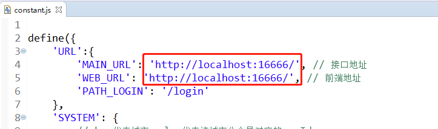

## 相关问题解答

### 关于项目架构
- 本项目采用前后端分离、B/S框架
- **本项目代码目前还在持续更新**，我也会不定期的增加一些功能，或者优化一下算法，有需要的可以定期拉取最新代码学习
- 前端使用的是 RequireJS 架构，所有前端静态代码，都存在于static目录下，可以独立运行，也可以跟后端代码打包到一起运行
- 后端使用spring boot + maven + mybatis + lombok + opencv 相关技术框架， 具体使用版本、使用方法，请查询doc目录下相关文档
- 前后端对接，ip:port 在 `yx-image-recognition\src\main\resources\static\js\common\constant.js` 设置即可

### 关于识别失败、识别错误、识别成功率的问题
- **首先，这个项目只是一个demo项目，仅供交流学习使用，并不是一个开箱即用的产品**
- 其次，对于图片的车牌识别，也是有场景要求的，比如：白天场景下调试的算法、及训练模型，不一定适用于夜间场景的图片识别；蓝牌的不适用于绿牌等等；这是因为算法的一些参数配置不具备通用性
- 识别失败的问题，一般是出现在提取车牌图块、提取字符图块的算法中，提取算法是有一定的通用行的，所以也是有成功率的；当前项目是一个demo项目，提取算法没有经过调试及调优，提取成功率比较低
- 识别错误的问题，这个跟提取算法、训练算法、训练结果都有关系；当前算法未经过调优、训练样本也比较单一比较少，所以成功率也不高
- 识别成功率的问题，当前项目识别成功率比较低，具体多少还没有测试计算过，，其他EasyPR、EasyPR-Java相关项目说成功率在80%左右，这个比例我是不敢苟同的

### 如何提升识别成功率
- 先有图片，然后有车牌，然后有字符切图，有了切图之后再进行标注训练，然后再反过来识别字符；
- 先提高了字符切图提取算法的准确率，才能有效提高识别成功率，，这个顺序不能乱
- 并非是训练样本越多，花样越多，训练的结果就越准确的，虽然有一定的关系，但不是必然关系，样本太多，有时候反而会降低识别成功率
- 训练的结果，是跟样本提取方法是有对应关系的，别人的训练结果不一定适合自己的算法

### 如何优化切图提取算法
- 学习图像处理的相关知识；并且学以致用，从而找到适合自己的的算法
- 举个栗子：当前的实现方式是提取图像轮廓，根据轮廓提取车牌，然后识别是否是车牌，你可以考虑通过色彩范围来提取车牌，然后进行识别
- 再举个栗子：当前demo是拿网上的图片进行开发测试的，，有的人用的时候，拿自己手机拍摄的照片，总是识别不出来一样，算法也是要贴合自己的应用场景的
- 可以借鉴一些人脸识别算法、证件文字识别算法、视频图像识别算法等

### [问题]no opencv_java401 in java.library.path
- 请详细查阅 `doc/01_开发环境搭建.md`
- 需要将opencv安装目录\build\java\x64目录下dll文件(opencv_java401.dll)，拷贝到\build\x64\vc14\bin目录下，其中x64、vc14根据实际版本自行调整

### [问题]no jniopencv_core in java.library.path
- no jniopencv_core in...，表示jniopencv_core类加载异常，jniopencv_core类命名为jni开头，表示该类用于java 调用 c++的过程，从而确定该类存在于 opencv-4.0.1-1.4.4-windows-x86_64.jar依赖包中
- 将 opencv-4.0.1-1.4.4-windows-x86_64.jar 添加到build path
- 或者，修改pom文件，取消opencv-4.0.1-1.4.4 gav坐标引入注释即可
- 不同操作系统，自行切换版本即可

