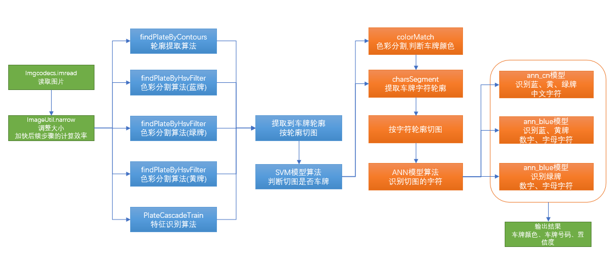
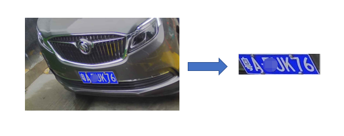
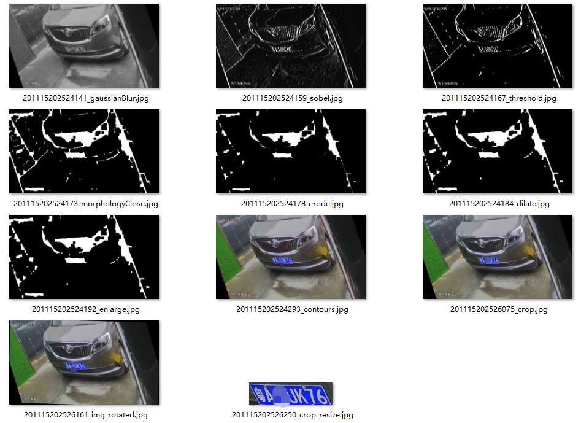
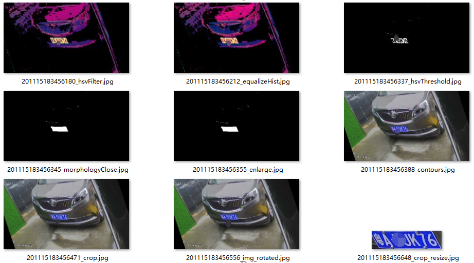
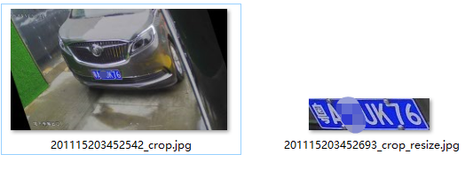
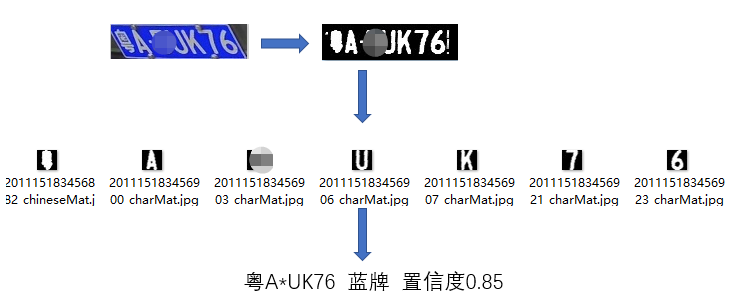
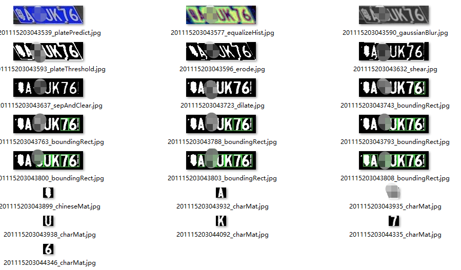

## 车牌识别过程说明文档

整体流程主要分两个大的步骤：
- 1、使用多种算法，提取到车牌的轮廓，按轮廓从原图片获取车牌的切图，使用SVM算法模型，判断该切图是否是车牌
- 2、根据车牌切图，判定车牌颜色，同时使用轮廓提取算法，提取车牌字符轮廓，按轮廓从二值图片获取车牌切图；使用ANN算法模型，分别使用中文字符模型、蓝牌模型、绿牌模型识别字符切图的文字内容




### 车牌图块提取
其目的是从车牌图片中，提取到包含车牌的图块；这里有三种实现方式：
- 1、轮廓提取算法
- 2、色彩分割提取算法
- 3、特征识别提取算法


#### 1、轮廓提取算法
主要的图片处理过程如下：
 


```
- 读取图像，转换大小，然后灰度化图像；
- 高斯模糊，去除噪点；
- sobel运算，检测图像边缘
- 图像二值化，将边缘转成白色(取值255)，其他内容转为黑色(取值0)
- 图像闭操作，将临近的边缘线，合并成块
- 边缘腐蚀操作，将一些细小的连接线去掉，分离出一些大的块装区域
- 边缘膨胀，还原腐蚀操作影响的块状区域大小
- 还原图像到原始图像大小，根据二值图像，提取轮廓
- 根据提取的轮廓，从原始图像上，切图
- 将得到的切图，调整到固定大小： 136*36像素，用于SVM算法模型，判断是否是车牌
```

- 该方法是互联网上常见的处理办法，大体流程基本一致，我这里稍微整理，也增加了一些优化；
- 以上操作步骤，还会包含一些其他小的步骤，比如：轮廓筛选、图像旋转校正等等，这里不详细展开
- 以上操作步骤也并非所有都必要，我的项目其目的在于学习交流，重点在于算法的实现
- 这种方法可以说比较具有通用性，自己调整一下一下各个步骤的一些参数，也能在特定场景下，大大增加识别准确率

---------------------------


#### 2、色彩分割提取算法

主要的图片处理过程如下：

```
- 转换到HSV色彩空间，对hsv取值范围过滤(取值范围，可以使用我的色彩切割工具，大体定位)；
- 蓝牌、绿牌、黄牌的操作步骤基本一致，区别仅在于HSV取值范围不一样
- 图像均衡化，增强对比度
- 图像二值化，得到车牌区域
- 图像闭操作，将车牌区域连成片
- 还原图像到原始图像大小，根据二值图像，提取轮廓
- 根据提取的轮廓，从原始图像上，切图
- 将得到的切图，调整到固定大小： 136*36像素，用于SVM算法模型，判断是否是车牌
```
- 该方法是我自己想到的一种方法，应该也算是比较老套的办法了
- 以上操作步骤，还会包含一些其他小的步骤，比如：轮廓筛选、图像旋转校正等等，这里不详细展开
- 以上操作步骤也并非所有都必要，我的项目其目的在于学习交流，重点在于算法的实现
- 这种方法在特定场景下，识别准确率比较高

---------------------------

#### 3、特征识别提取算法

主要的图片处理过程如下：

```
- 使用harrcascade模型，直接识别图片中的图块位置，提取图块切图
- 将得到的切图，调整到固定大小： 136*36像素，用于SVM算法模型，判断是否是车牌
```

- 这种方法，应用应该也比较广泛，人脸识别也常用这种方法
- 我尝试去实现了一下这种算法，估计是我的模型训练样本的问题，成功率很低，
- 特征识别的算法有很多，harr的算法比较老套了，我打算去尝试其他特征识别算法，所以这里就先放弃了


---------------------------

### 车牌字符识别
其目的是从车牌图块中，识别车牌的颜色、车牌号码


#### 图片debug过程

```
- 使用SVM模型算法，判断图块是否是车牌
- 将图块转到HSV色彩空间，图像均衡化之后，根据H的取值范围及占比，计算属于何种颜色车牌
- 原图灰度化、高斯模糊
- 然后直接二值化；对于车牌来说一般仅包含两种颜色
- 边缘腐蚀、膨胀
- 水平或者垂直方向投影去除边框、铆钉干扰等
- 错切校正
- 轮廓提取，轮廓位置、大小校正、轮廓过滤等
- 提取字符图块，调整为统一大小20*20像素，使用ANN算法，识别图块的字符，计算置信度等
```

- 车牌字符识别，这种方式比较通用，成功率也比较高
- 以上操作步骤并非所有都必要，我的项目其目的在于学习交流，重点在于算法的实现
- 当然还有别的识别方案，我就不打算继续展开了


