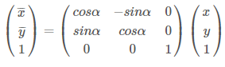
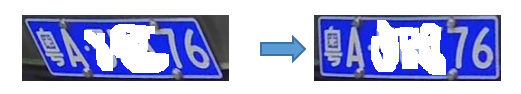

# 车牌识别部分算法说明文档


## 图像通道
OpenCV 中，图像可以分别为1，2，3，4 通道
- 1 通道为灰度图；
- 2 通道的图像是RGB555和RGB565。2通道图在程序处理中会用到，如傅里叶变换，可能会用到，一个通道为实数，一个通道为虚数，主要是编程方便。RGB555是16位的，2个字节，5+6+5，第一字节的前5位是R，后三位+第二字节是G，第二字节后5位是B，可见对原图像进行压缩了
- 3 通道为彩色图（RGB）；
- 4 通道为 RGBA ，是RGB加上一个A通道，也叫alpha通道，表示透明度，PNG图像是一种典型的4通道图像。alpha通道可以赋值0到1，或者0到255，表示透明到不透明

CvType 类型常量组合规则
- byte : 比特数，位数。 有 8byte，16byte，32byte，64byte；对应在Mat中，每个像素的所占的空间大小，8位即 CV_8
- U|S|F ：
 - U : unsigned int , 无符号整形
 - S : signed int , 有符号整形
 - F : float , 单精度浮点型, float类型本身即有符号
这里的有符号、无符号是针对图像二进制编码来讲的。我在写的过程中大多数情况下都是使用的无符号，即 CV_8U ,CV_16U，当有计算时
- C[channels]：图像的通道数

**比如 CV_8UC3 即 8位无符号的3通道（RGB 彩色）图像**


## 灰度图像
- 彩色图像通常包括R、G、B三个分量，**灰度化就是使彩色图像的R、G、B三个分量相等的过程**
- 灰度图像中每个像素仅具有一种样本颜色，其灰度是位于黑色与白色之间的多级色彩深度，
- 灰度值大的像素点比较亮，反之比较暗，像素值最大为255（表示白色），像素值最小为0（表示黑色）
- `Imgproc.cvtColor(inMat, dst, Imgproc.COLOR_BGR2GRAY);`
- https://leejason.blog.csdn.net/article/details/106416128


## 图像滤波（降噪）
- 图像滤波，即在尽量保留图像细节特征的条件下对目标图像的噪声进行抑制，是图像预处理中不可缺少的操作，其处理效果的好坏将直接影响到后续图像处理和分析的有效性和可靠性
- 目的有两类：**一类是模糊；另一类是消除噪音**

### 高斯滤波
也叫高斯模糊，模糊原理：
- 拿一个矩阵（3X3, 5X5）等，和原图从左向右从上到下分别进行卷积，将卷积值最后赋值个当前卷积的中心像素
- 矩阵的大小和矩阵的值，通常称矩阵为卷积核
- 用于 抑制噪声，平滑图像，防止把噪点也检测为边缘
- 高斯滤波相比于均值滤波对图像个模糊程度较小
```java
public static final int BLUR_KERNEL = 3;  // 滤波内核大小必须是 正奇数 
public static void gaussianBlur(Mat inMat, Mat dst) {
	Size ksize = new Size(BLUR_KERNEL, BLUR_KERNEL); //3x3 // 高斯滤波内核宽高可以不一样，但都必须正奇数
	Imgproc.GaussianBlur(inMat, dst, ksize, 0, 0, Core.BORDER_DEFAULT);
}
```
https://blog.csdn.net/qq_35294564/article/details/81142524

### 中值滤波
用像素点领域灰度值的中值来代替该像素点的灰度值也就是说用一片区域的中间值来代替所有值。可以**除去最大，最小值**
- 除去斑点噪声和椒盐噪声很有用。均值滤波噪声也被参与运算
- 中值滤波时间在均值滤波的5倍以上
```java
public static final int BLUR_KERNEL = 3;  // 滤波内核大小必须是 正奇数
public static void medianBlur(Mat inMat, Mat dst) {
	Size ksize = new Size(BLUR_KERNEL, BLUR_KERNEL); //3x3
	Imgproc.MedianBlur(inMat, dst, ksize, 0, 0, Core.BORDER_DEFAULT);
}
```

### 均值滤波
均值滤波本身存在着固有的缺陷，即它不能很好地保护图像细节，在图像去噪的同时也破坏了图像的细节部分，从而使图像变得模糊，不能很好地去除噪声点。特别是椒盐噪声
```java
public static final int BLUR_KERNEL = 5;  // 滤波内核大小必须是 正奇数
public static void blur(Mat inMat, Mat dst) {
	Point anchor = new Point(-1,-1);
	Size ksize = new Size(BLUR_KERNEL, BLUR_KERNEL);
	Imgproc.blur(inMat, dst, ksize, anchor, Core.BORDER_DEFAULT);
}
```


## 仿射变换
一般对图像的变化操作有放大、缩小、旋转等，统称为**几何变换**；主要的图像变换有：仿射变换、投影变换、极坐标变换；
对一个图像的图像变换主要有两大步骤：
- **实现空间坐标的转换，就是使图像从初始位置到终止位置的移动**
- **使用一个插值算法完成输出图像的每个像素的灰度值**
 - INTER_NEAREST		最近邻插值
 - INTER_LINEAR		双线性插值（默认）
 - INTER_AREA		使用像素区域关系进行重采样  **缩小**图像的时候使用
 - INTER_CUBIC		4x4像素邻域的双三次插值   **放大**图像的时候使用
 - INTER_LANCZOS4	8x8像素邻域的Lanczos插值


### 平移
平移是最简单的仿射变换；如将空间坐标（x,y)沿着x轴移动100，沿着y轴移动200。平移后的坐标为(x+100,y+200)
将这个过程一般化后，假设任意的空间坐标（x,y)先沿着x轴平移Px再沿着y轴平移Py。得到的坐标为（x+Px,y+Py)。
用矩阵表示这个平移过程为：


即： `dst = A * inMat` A为仿射矩阵

```java
/**
 * @param pX 水平方向移动像素； 大于0则表示沿着轴正向移动，若小于0则表示沿着轴负向移动
 * @param pY 垂直方向移动像素； 大于0则表示沿着轴正向移动，若小于0则表示沿着轴负向移动
 */
public static void translateImg(Mat inMat, Mat dst, int pX, int pY){
	//定义平移矩阵 创建2行3列的全0矩阵; 
	// 正常应该3×3，但是最后一行取值已经固定为 0 0 1
	Mat trans_mat = Mat.zeros(2, 3, CvType.CV_32FC1);
	trans_mat.put(0, 0, 1);
	trans_mat.put(0, 2, pX);
	trans_mat.put(1, 1, 1);
	trans_mat.put(1, 2, pY);
	// 仿射变换  size如果使用inMat，则保持原有画布尺寸大小，使用dst的size，可以自行调整画布大小
	Imgproc.warpAffine(inMat, dst, trans_mat, inMat.size()); 
}
```
如果已知inMat以及其放射变换后的dstMat矩阵，从而计算出变换后的坐标，就需要放射矩阵的计算，
主要的实现方法有：方程法，矩阵法，插值算法


### 缩放
一般设备采集到的图片像素比较大；**像素过高，会导致计算时间耗时过高**；可以考虑缩小图片来进行相关计算
注意：**图片缩放算法可能导致车牌轻微变形，也会导致清晰度降低**，影响计算结果
解决变形办法：
- 锁定宽高比就行缩放
- 提取到轮廓之后，将轮廓图还原成原图大小，然后从原图提取车牌切图


```java
/**
 * 按最大宽度，计算放大/缩小比例
 * 锁定纵横比
 */
public static Mat zoom(Mat inMat, Integer maxWidth){
	Double ratio = maxWidth * 1.0 / inMat.width();
	Integer maxHeight = (int)Math.round(ratio * inMat.height());
	Mat dst = new Mat(maxHeight, maxWidth, inMat.type());
	zoom(inMat, dst, ratio, ratio, debug, tempPath);
	return dst;
}
/**
 * 不锁定纵横比
 * @param x 水平方向变换比例; 大于1则放大，小于1则缩小
 * @param y 垂直方向变换比例; 大于1则放大，小于1则缩小
 */
public static void zoom(Mat inMat, Mat dst, Double x, Double y){
	Mat trans_mat = Mat.zeros(2, 3, CvType.CV_32FC1);
	trans_mat.put(0, 0, x);
	trans_mat.put(1, 1, y);
	Imgproc.warpAffine(inMat, dst, trans_mat, dst.size()); // 仿射变换
}
```
`warpAffine(Mat src, Mat dst, Mat M, Size dsize, int flags, int borderMode, Scalar borderValue)`

warpAffine的默认值： int flags = INTER_LINEAR, int borderMode = BORDER_CONSTANT, Scalar borderValue = Scalar()
使用放射变换**Imgproc.warpAffine，跟Imgproc.resize其实是一样的**，可以通过参数选择插值算法；
```java
/**
 * 放大、缩小图片，锁定横纵比
 */
public static Mat zoom(Mat inMat, Integer maxWidth) {
	Double ratio = maxWidth * 1.0 / inMat.width();
	Integer maxHeight = (int)Math.round(ratio * inMat.height());
	Mat dst = new Mat(maxHeight, maxWidth, inMat.type());
	if(ratio > 1.0){	// INTER_CUBIC 放大图像的时候使用
		Imgproc.resize(inMat, dst, dst.size(), ratio, ratio, Imgproc.INTER_CUBIC);
	} else {	// INTER_AREA 缩小图像的时候使用 
		Imgproc.resize(inMat, dst, dst.size(), ratio, ratio, Imgproc.INTER_AREA);
	}
	return dst;
}

```
`resize(Mat src, Mat dst, Size dsize, double fx, double fy, int interpolation)`

- fx, fy 沿x轴，y轴的缩放系数

 ```
 fx, fy 入参为零的时候，默认值为如下计算方式：
 double fx = resized.cols() * 1.0 /inMat.cols();
 double fy = resized.rows() * 1.0 /inMat.rows();
 ```
 
- interpolation 插入方式
```
	- INTER_NEAREST		最近邻插值
	- INTER_LINEAR		双线性插值（默认）
	- INTER_AREA		使用像素区域关系进行重采样  缩小图像的时候使用
	- INTER_CUBIC		4x4像素邻域的双三次插值   放大图像的时候使用
	- INTER_LANCZOS4	8x8像素邻域的Lanczos插值
```

### 旋转

**angle 旋转角度大于0则顺时针，小于0则逆时针**

```java
public static void rotateImg(Mat inMat, Mat dst, double angle, Point center){
	Mat img_rotated = Imgproc.getRotationMatrix2D(center, angle, 1); // 获取旋转矩阵
	Imgproc.warpAffine(inMat, dst, img_rotated, inMat.size());
}
```

轮廓提取，获取到最小外接斜矩形，**图片水平方向轴逆时针旋转，首次跟斜矩形平行时，平行的边即为矩形的width**，这条边于水平方向的夹角，即为angle角度；所以在提取到斜矩形之后，需要判断width边跟height边的长短
旋转校正图片时，可以根据斜矩形矩形的angle进行旋转，如下：

 

### 错切

从原图取三个点，计算转后的三个点，从而得到变换矩阵，将原图进行转换
如上车牌图片，转换前得到车牌轮廓的最小外接矩形，经过转换之后，外接矩形的宽度要减少相应的像素，否则矩形过大，提取的车牌不精确

```java
public static void warpPerspective(Mat inMat, Mat dst){
	// 原图四三顶点
	MatOfPoint2f srcPoints = new MatOfPoint2f();
	srcPoints.fromArray(new Point(0, 0), new Point(0, inMat.rows()), new Point(inMat.cols(), 0));
	// 目标图三个顶点
	MatOfPoint2f dstPoints = new MatOfPoint2f();
	dstPoints.fromArray(new Point(0 + 80, 0), new Point(0 - 80, inMat.rows()), new Point(inMat.cols() + 80, 0));
	Mat trans_mat  = Imgproc.getAffineTransform(srcPoints, dstPoints); // 变换矩阵
	Imgproc.warpAffine(inMat, dst, trans_mat, inMat.size()); 
}
```


### 投影变换
也叫透视变换; 是将图片投影到一个新的视平面
就好像放胶片电影一样，有一个光源，照射到胶片，得到幕布上的投影；随着光源位置的变换，幕布上的投影跟着变换

从原图inMat取四个点，计算转换后的四个点，从而得到变换矩阵，将原图进行转换
这里以原图四个顶点为例

```java
public static void warpPerspective(Mat inMat, Mat dst){
	// 原图四个顶点
	MatOfPoint2f srcPoints = new MatOfPoint2f();
	srcPoints.fromArray(new Point(0, 0), new Point(0, inMat.rows()), 
		new Point(inMat.cols(), 0), new Point(inMat.cols(), inMat.rows()));
	// 目标图四个顶点
	MatOfPoint2f dstPoints = new MatOfPoint2f();
	dstPoints.fromArray(new Point(0 + 80, 0), new Point(0 - 80, inMat.rows()), 
		new Point(inMat.cols() + 80, 0) , new Point(inMat.cols() - 80, inMat.rows()));
	Mat trans_mat  = Imgproc.getPerspectiveTransform(srcPoints, dstPoints); // 变换矩阵
	Imgproc.warpPerspective(inMat, dst, trans_mat, inMat.size()); // 投影变换
}
```

相对于仿射变换的错切校正来说，**错切校正是三点法，投影变换是四点法**，对于车牌图像处理，二者的效果差不多，但是**三点法执行效率要高**


### 参考文档
https://www.cnblogs.com/supershuai/p/12317652.html


## 边缘检测


### Sobel运算
- 也叫sobel算子，边缘检测算子
- 是一阶梯度算法；对图像中的像素点进行导数运算，得到图像的一阶水平方向导数；从而**得到相邻两个像素点的差异值**
- 具有平滑噪声作用，提供较为精确的边缘方向信息，边缘定位精度不够高。
- 当对精度要求不是很高时，是一种较为常用的边缘检测方法

```java
public static final int SOBEL_SCALE = 1;
public static final int SOBEL_DELTA = 0;
public static final int SOBEL_X_WEIGHT = 1;
public static final int SOBEL_Y_WEIGHT = 0;
public static final int SOBEL_KERNEL = 3;// 内核大小必须为奇数且不大于31
public static final double alpha = 1.5; // 乘数因子
public static final double beta = 10.0; // 偏移量
public static void sobel(Mat inMat, Mat dst) {
	Mat grad_x = new Mat();
	Mat grad_y = new Mat();
	Mat abs_grad_x = new Mat();
	Mat abs_grad_y = new Mat();
	// 计算水平方向灰度梯度的绝对值
	Imgproc.Sobel(inMat, grad_x, CvType.CV_8U, 1, 0, SOBEL_KERNEL, SOBEL_SCALE, SOBEL_DELTA, Core.BORDER_DEFAULT); 
	Core.convertScaleAbs(grad_x, abs_grad_x, alpha, beta);   // 增强对比度
	// 计算垂直方向灰度梯度的绝对值
	Imgproc.Sobel(inMat, grad_y, CvType.CV_8U, 0, 1, SOBEL_KERNEL, SOBEL_SCALE, SOBEL_DELTA, Core.BORDER_DEFAULT);
	Core.convertScaleAbs(grad_y, abs_grad_y, alpha, beta);
	// 计算结果梯度
	Core.addWeighted(abs_grad_x, SOBEL_X_WEIGHT, abs_grad_y, SOBEL_Y_WEIGHT, 0, dst);
}
```

### scharr运算
scharr算子会带来更多图片的边缘细节

```java
public static void scharr(Mat inMat, Mat dst) {
	Mat grad_x = new Mat();
	Mat grad_y = new Mat();
	Mat abs_grad_x = new Mat();
	Mat abs_grad_y = new Mat();
	//注意求梯度的时候我们使用的是Scharr算法，sofia算法容易受到图像细节的干扰
	Imgproc.Scharr(inMat, grad_x, CvType.CV_32F, 1, 0);
	Imgproc.Scharr(inMat, grad_y, CvType.CV_32F, 0, 1);
	//openCV中有32位浮点数的CvType用于保存可能是负值的像素数据值
	Core.convertScaleAbs(grad_x, abs_grad_x);
	Core.convertScaleAbs(grad_y, abs_grad_y);
	//openCV中使用release()释放Mat类图像，使用recycle()释放BitMap类图像
	grad_x.release();
	grad_y.release();
	Core.addWeighted(abs_grad_x, 0.5, abs_grad_y, 0.5, 0, dst);
	abs_grad_x.release();
	abs_grad_y.release();
}
```

## 图像二值化

### 二值化最佳阈值计算
xxxx

### 二值计算
xxxx

### 闭操作
xxxx

### 边缘腐蚀、边缘扩张
xxxx

## 轮廓提取
xxxx


持续更新中....